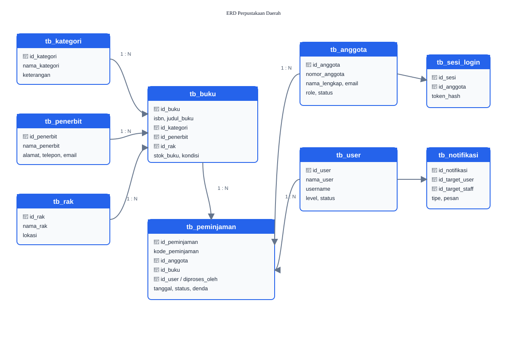

# 📚 Perpustakaan Daerah

> Sistem informasi perpustakaan berbasis PHP Native dan MySQL untuk mengelola katalog, anggota, peminjaman, pengembalian, serta administrasi perpustakaan secara terintegrasi.


## ✨ Fitur

### Pengguna

- 🔐 Registrasi dan login
- 📖 Katalog serta pencarian buku
- 📚 Peminjaman dan pengembalian buku
- 🕘 Riwayat peminjaman
- ⭐ Rating dan komentar buku
- 🏆 Badge pencapaian
- 🔔 Notifikasi pengguna
- 👤 Pengelolaan profil

### Admin & Petugas

- 📊 Dashboard administrasi
- 🗂️ CRUD buku, kategori, penerbit, dan rak
- ✅ Persetujuan pengembalian
- 💰 Perhitungan denda
- 👥 Manajemen anggota dan akun
- 📰 Pengelolaan informasi, banner, layanan, dan FAQ
- 📄 Generate dokumentasi PDF

## 🛠️ Teknologi

| Komponen | Teknologi |
| --- | --- |
| Backend | PHP 8+ Native |
| Database | MySQL / MariaDB |
| Frontend | HTML5, CSS3, Bootstrap |
| JavaScript | JavaScript, jQuery |
| Server | Apache / XAMPP |
| PDF | dompdf |

## 🏗️ Struktur Fitur

```text
Perpustakaan Daerah
├── Autentikasi
│   ├── Login
│   ├── Registrasi
│   └── Logout
├── Katalog Buku
│   ├── Daftar buku
│   ├── Pencarian
│   └── Detail buku
├── Transaksi
│   ├── Peminjaman
│   ├── Pengembalian
│   └── Riwayat
├── Interaksi Pengguna
│   ├── Rating & komentar
│   ├── Badge
│   └── Notifikasi
└── Admin Panel
    ├── Dashboard
    ├── Manajemen data
    ├── Informasi perpustakaan
    └── Laporan / PDF
```

## 🗃️ Relasi Database

Diagram berikut menggambarkan relasi utama pada database perpustakaan, terutama hubungan antara anggota, buku, kategori, penerbit, rak, user/petugas, dan transaksi peminjaman.



> Sumber skema database: [`admin/database.sql`](./admin/database.sql)

## 🚀 Menjalankan Project

### Persyaratan

- PHP 8.0 atau lebih tinggi
- MySQL 5.7+ atau MariaDB 10.3+
- Apache dengan XAMPP atau server PHP sejenis

### Instalasi

```bash
git clone https://github.com/farahquinn14528-ui/perppus_daerahukk.git
```

1. Pindahkan folder project ke `C:\xampp\htdocs\`.
2. Jalankan **Apache** dan **MySQL** melalui XAMPP.
3. Buat database bernama `perpustakaan_daerah` melalui phpMyAdmin.
4. Import file `admin/database.sql`.
5. Buka aplikasi melalui browser:

```text
http://localhost/perppus_daerahukk/admin/
```

## 📁 Struktur Repository

```text
perppus_daerahukk/
├── admin/                         # Source code aplikasi PHP
│   ├── database.sql               # Skema dan data database
│   ├── login.php                  # Autentikasi
│   ├── katalog_buku.php           # Katalog buku
│   ├── pinjam.php                 # Peminjaman
│   ├── pengembalian.php           # Pengembalian
│   └── ...
├── docs/
│   └── database-erd.svg           # Diagram relasi database
├── Screenshot 2026-08-28 085937.png
├── DOKUMENTASI_PERPUSTAKAAN_DAERAH_VERSI1.pdf
└── README.md
```

## 📖 Dokumentasi

- [Dokumentasi aplikasi](./DOKUMENTASI_PERPUSTAKAAN_DAERAH_VERSI1.pdf)
- [Dokumentasi admin](./admin/README.md)
- [Daftar fungsi file](./admin/DAFTAR_FUNGSI_FILE.md)
- [Daftar tabel database](./admin/DAFTAR_TABEL.md)
- [Perencanaan proyek](./admin/PERENCANAAN_PROYEK_PERPUSTAKAAN_DAERAH_V5.md)

## 🔑 Akun Demo

> Kredensial berikut mengikuti dokumentasi proyek dan dapat berbeda setelah database diubah.

| Peran | Username / Email | Password |
| --- | --- | --- |
| Admin | `admin` | `admin123` |
| Petugas | `petugas` | `admin123` |
| Anggota | `ahmad@email.com` | `admin123` |

## 📌 Status

✅ Versi 1.0 — siap dikembangkan lebih lanjut untuk kebutuhan perpustakaan daerah.

## 📄 Lisensi

© 2026 Perpustakaan Daerah. All rights reserved.
